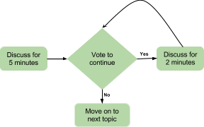

# Retrospective Lean Coffee

1. Ensure everyone arrives with a fresh drink.
2. Follow up action points from previous retrospective [5 minutes].
3. Sit around a table and create three columns “To Do”, “Doing”, and “Done”.
4. Everyone writes post-its on the topics they want to discuss [5 minutes].
5. Put your post-its in the “To Do” column [5 minutes].
    * Explain the topics to the group.
    * Group similar topics.
6. Prioritize the order by dot voting* and then move into order of most dots to least [5 minutes].
7. Choose the topics with the most votes and set a 5-minute timer to discuss.
    After 5 minutes :
    * vote to continue discussing (add 2-minute timer)
    * vote to move on write down actions and assign an owner

## To Finish, fist to five (5 Minutes)

1. Everyone shows a fist
2. Rate the retrospective from 0 (the fist) to 5 (fingers)
    * what would make this a 5?

Dot voting:

1. Each team member has 3-5 votes (stickers)
2. Everyone votes at the same time, They can put all their votes on one topic they care deeply about or spread them out
